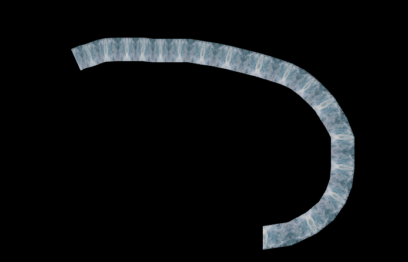

# Terrible 2D Trail Renderer using WebGL
An attempt at learning the basics of WebGL to hopefully be able make more complex effects with WebGL in the future (and also maybe learn a bit of OpenGL in the process, although probably not much)

The main goal of this repository is to hopefully provide you with an idea on how to do this so you know the rough starting point because, and this is often the case, if you search "How to make blablablablabla in WebGL" it's likely the tutorial is gonna be about 3D, but I want 2D so what the heck

## The idea
- **Generating the mesh**: the headGeometry define the shape of the head, in this case you probably want it to contain 2 points, we will then add the headGeometry to the trailsGeometry to form the quad needed based on some conditions like: the turn angle, the length of the quad, blablabla
  
- **To calculate those two points mentioned**: you just need to keep track of the mouse positions to form a rough skeleton for the trail. Then we can calculate the unit vector from the previous mouse position to the current, that will be our unit vector, we can then invert the x and y to obtain the normal vector and use that to calculate the new 2 points

- Feel free to create a new issue if you need help I guess

## Running
Just set up a local web server and start moving with your mouse, the trail will appear

## Issues
- Unpleasant artifacts when the mouse move too little or take a really sharp turn (It's probably skill issue from my part, I have no idea how to fix it)
- Also code is terrible because it is written by me
- Probably more but idk

## Credits
- The head geometry and trail geometry idea is stolen from [this repo](https://github.com/mkkellogg/TrailRendererJS) lol
- The texture is from [CC0 Textures](https://cc0-textures.com/)

### Thanks for dropping by! ♥